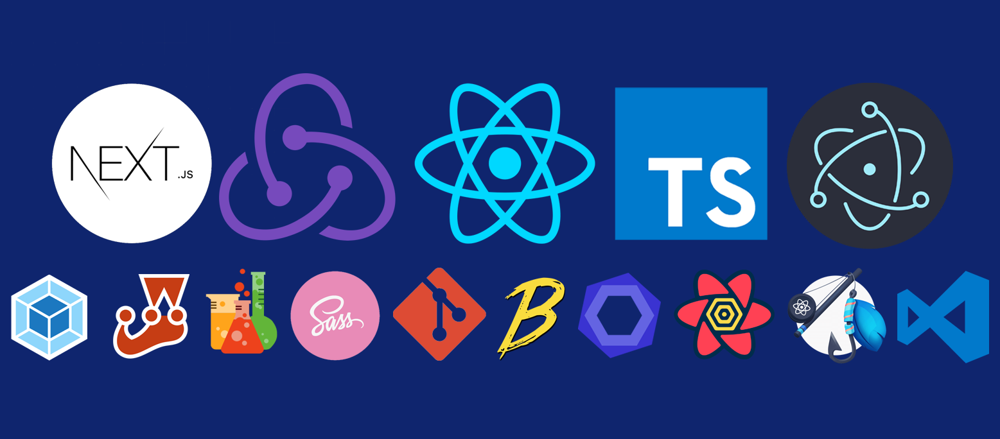

- 👋 Hi, I’m @muhammadtalha242
- 👀 I’m interested in 💻🕸
- 🌱 I’m currently learning 
- 📫 How to reach me m.talha2244@gnail.com

### 🛠 &nbsp;My Stack

&nbsp;

&nbsp;
&nbsp;

&nbsp;
&nbsp;

&nbsp;

&nbsp;
&nbsp;
&nbsp;
&nbsp;
&nbsp;

### ⚙️ &nbsp;Analytics

